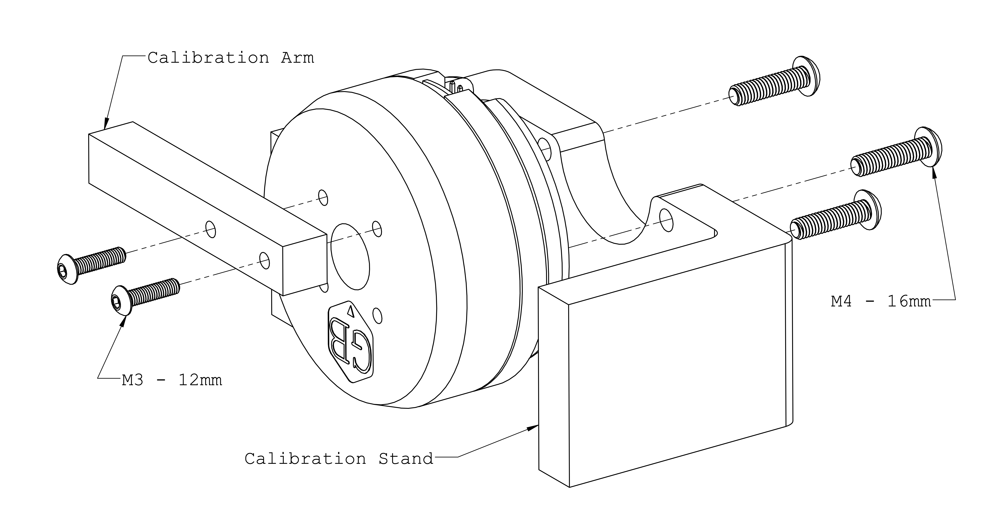
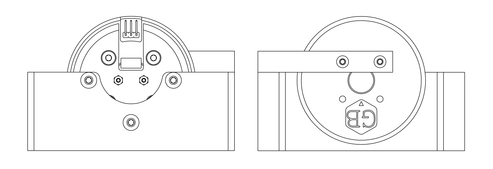
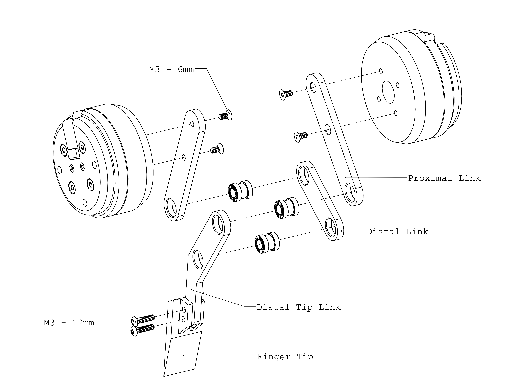
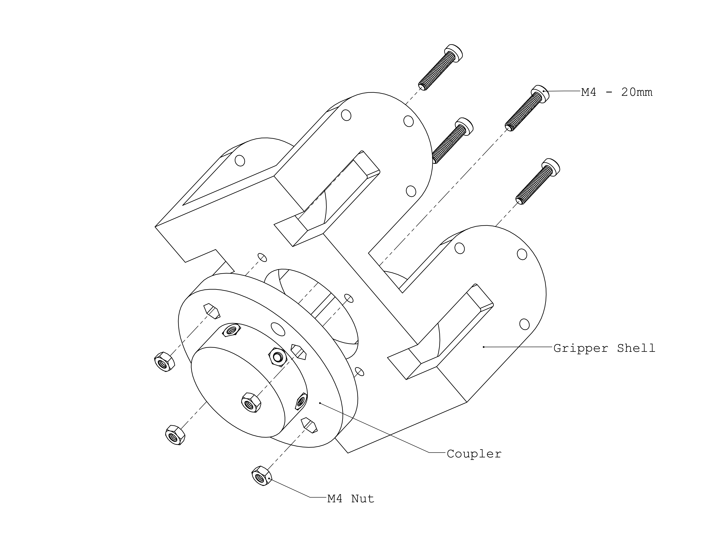

# Direct-Drive Hand

In this project, we have implemented a two-fingered 4-DoF direct-drive hand, inspired by the work ["Direct Drive Hands: Force-Motion Transparency in Gripper Design"](http://www.roboticsproceedings.org/rss15/p53.pdf). 


# Table of Contents

- [Preparation](#preparation)
  - [Bill of Materials (BOM)](#bom)
    - [Purchase](#purchase)
    - [3D Printing](#3d-printing)
  - [Install `pyddh`](#install-pyddh)
  - [Label Components](#label-components)
- [Actuators](#actuators)
  - [Actuator Assembly ⨉4](#assemble-actuators)
  - [Wiring](#wiring)
    - [Encoder Connection](#encoder-connection)
    - [Power Connection](#power-connection)
  - [Actuator Calibration](#actuator-calibration)
    - [Calibrate ODrives](#calibrate-odrives)
    - [Calibrate Encoders](#calibrate-encoders)
- [Gripper](#Gripper)
  - [Finger Assembly ⨉2](#finger)
  - [Gripper Assembly](#gripper-assembly)
  - [Mounting](#mounting)
  - [Gripper Calibration](#gripper-calibration)
    - [Calibrate Motor Direction](#calibrate-motor-direction)
    - [Calibrate Linkages](#calibrate-linkages)
    - [Configure Gripper Geometry](#configure-gripper-geometry)
- [Customization](#customization)
  - [Mounting](#custom-mounting)
  - [Linkages](#linkages)
- [Getting Started](#getting-started)


# Preparation

<a name="bom"></a>

## Bill of Materials (BOM)


### Purchase

- [ODrive 3.6-56V](https://odriverobotics.com/shop/odrive-v36) ⨉2
- [T-Motor GB54-2](https://store.tmotor.com/goods.php?id=445) ⨉4
- [AS5048A Encoder + Diametrical Magenet](https://item.taobao.com/item.htm?id=619004953504) ⨉4
- [Bearing - outer-diameter = 10mm, inner-diameter = 6mm](https://item.taobao.com/item.htm?id=649671875461) ⨉12
- [Dowel Pin - diameter = 6mm, length = 10mm](https://detail.tmall.com/item.htm?id=522002486638) ⨉6
- [14-Core Shielded Cable TRVVSP4](https://detail.tmall.com/item.htm?id=649477061772) ⨉2 meters
- [MX1.25-6P 150mm Cable](https://item.taobao.com/item.htm?id=607231799768) ⨉4
- [AMASS Braided 3-Phase 90cm Cable](https://item.taobao.com/item.htm?id=520248392055) ⨉8
- Adapter Plate and Coupling: The gripper is primarily designed to be compatible with [Universal Robots UR10](https://www.universal-robots.com/products/ur10-robot/) (50mm PCD with 4 ⨉ M6, used with Robotiq's grippers). For other robot systems, see the section [Customization](#custom-mounting) for instructions.
- Various Fasteners from M2 to M4


### 3D Printing 

- [Magnet Holder](stl/magnet_holder.STL) ⨉4
- [Motor Plate](stl/motor_plate.STL) ⨉4
- [Proximal Link](stl/proximal_link.STL) ⨉4
- [Distal Link](stl/distal_link.STL) ⨉2
- [Distal Tip Link](stl/distal_tip_link.STL) ⨉2
- [Finger Tip](stl/finger_tip.STL) ⨉2
- [Actuator Mount](stl/actuator_mount.STL) ⨉1
- [Coupler](stl/coupler.STL) ⨉1
- [Calibration Stand](stl/calibration_stand.STL) ⨉4
- [Calibration Arm](stl/calibration_arm.STL) ⨉4


<a name="install-pyddh"></a>

## Install `pyddh`

`pyddh` *Rename to ddh-software* is our driver software that provides a user interface to the gripper hardware. To install, visit [here](https://github.com/HKUST-RML/pyddh).


## Part Labeling

To facilitate assembly, some parts need to be labeled as follows.

### Motors

Label the four motors with `R0`, `R1`, `L0`, `L1`, respectively. The motors will __not__ be interchangeable later on.  

### ODrive

Label the two ODrive boards with `ODrive_R` and `ODrive_L`, respectively. Plug each ODrive board into the computer and execute the command `odrivetools` *Also add how this works in practice in the terminal* in the terminal to check its serial number. Record their serial numbers in `pyddh/config/ddh_default.yaml`. 

```yaml
odrive_serial:
  R: 'Serial Number of ODrive_R'
  L: 'Serial Number of Odrive_L'
```

### Actuator Mount

On one side of the `Actuator Mount` (to be used as the top side), mark reference frames as follows.


# Actuators


<a name="assemble-actuator"></a>
## Actuator Assembly ⨉4


## Wiring

In this step, you need to connect the actuators to the ODrive boards. Each actuator has an encoder port and a 3-phase power port. Both need to be connected.


### Encoder Connection

For the encoder connection, you need to construct a encoder cable accroding the schematics below. This cable is quite tricky to make. Test the connectivity and resistance of each connection afterwards to make sure the cable is soldered properly. It is also recommanded to physically label each connector with its designated identifier.


Plug-in the encoder cable to the corresponding actuators. There is only one corret orientation for the plugs. Connect the other end of the encoder cable to the corresponding ODrive pins.

### Power Connection

For the power connection, connect each actuator to its designeated ODrive axis. 

| Actuator | ODrive | Axis |
|----|------|-----|
| R0 | ODrive_R | M0 |
| R1 | ODrive_R | M1 |
| L0 | ODrive_L | M0 |
| L1 | ODrive_L | M1 |

Keep the 3-phase connection consistent following the convention shown below.


## Actuator Calibration


### Calibrate ODrives


### Calibrate Encoders

Here we calibrate the zero position of the magnet. Mount the actuator on the calibration stand and install the calibration arm onto the actuator following the diagram



Execute the following command to show real-time reading from the encoders.
```shell
python3 -m pyddh.encoder_printer
```

Put the motor into zero position as show in the diagram below. The ports of the actuator is pointing up, and the hexagonal logo of the motor is pointing downwards. Press down the calibration arm to make sure the stand and arm touch tightly. 



Record the encoder reading in configuration in `ddh/config/ddh_default.yaml`. Perform this calibration for each actuator and record it in their respective keys in the configuration file.
```yaml
motors:
  R0: # and R1, L0, L1:
    offset: the encoder reading at zero stop
```


# Gripper

<a name="finger"></a>

## Finger Assembly ⨉2





## Gripper Assembly




## Mounting


## Gripper Calibration


### Calibrate Motor Direction

The following values in the configuration will be calibrated in this step

- `/motors/R0/dir`
- `/motors/R1/dir`
- `/motors/L0/dir`
- `/motors/L1/dir`


### Calibrate Linkages

The following values in the configuration will be calibrated in this step

- `/linkages/R0`
- `/linkages/R1`
- `/linkages/L0`
- `/linkages/L1`

```yaml
linkages:
  R0: -45
  R1: 45
  L0: 45
  L1: -45
```


### Configure Gripper Geometry


```yaml
geometry:
  l1: 50 # length of proximal links
  l2: 35 # length of distal links
  beta: 150 # angle from l2 to finger surface 
  l3: 80.04 # distance from distal joint to fingertip
  gamma: 160.66 # angle from l2 to fingertip
  # r: distance of distal joint to motor
  r_min_offset: 0 # r_min = sqrt(l1**2 - l2**2) + r_min_offset
  r_max_offset: 1 # r_max = l1 + l2 - r_max_offset
```


# Customization

<a name="custom-mounting"></a>

## Mounting


## Linkages


# Getting Started

You have completed the assembly and calibration of the direct-drive gripper. To learn about how to use the gripper, lease proceed to the [pyddh repository](https://github.com/HKUST-RML/pyddh) for tutorials and documation.


# Maintenance

For any technical issues, please contact Pu Xu ([pxuaf@connect.ust.hk](mailto:pxuaf@connect.ust.hk))
