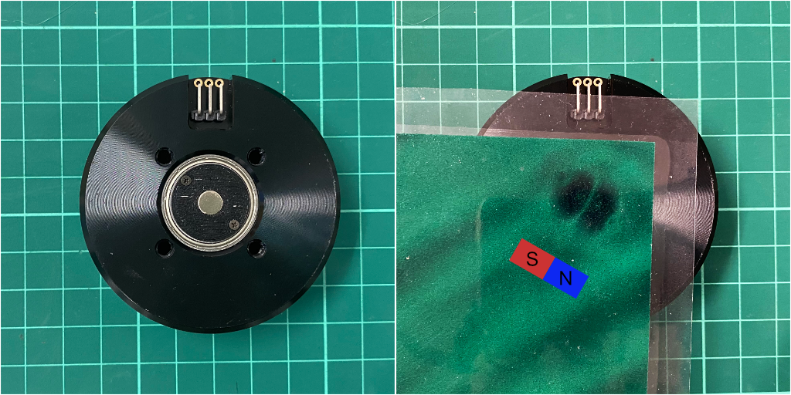

# Direct-Drive Gripper

The repo contains the hardware design and documentation of our in-house 2-finger 4-DoF direct-dirve gripper.


## Fabrication


Bill of Materials

- [ODrive 3.6-56V](https://odriverobotics.com/shop/odrive-v36) $\times 2$
- [T-Motor GB54-2](https://store.tmotor.com/goods.php?id=445) $\times 4$
- [AS5048A Encoder + Diametrical Magenet](https://item.taobao.com/item.htm?id=619004953504) $\times 4$
- [Bearing - outer-diameter = 10mm, inner-diameter = 6mm](https://item.taobao.com/item.htm?id=649671875461) $\times 12$
- [Dowel Pin - diameter = 6mm, length = 10mm](https://detail.tmall.com/item.htm?id=522002486638) $\times 6$
- [14-Core Shielded Cable TRVVSP4](https://detail.tmall.com/item.htm?id=649477061772) $\times 2\ \text{meters}$
- [MX1.25-6P 150mm Cable](https://item.taobao.com/item.htm?id=607231799768) $\times 4$
- [AMASS Braided 3-Phase 90cm Cable](https://item.taobao.com/item.htm?id=520248392055) $\times 8$
- Mounting Couplers (*)
- Various Fasteners from M2 to M4


3D Printing 

- Magnet Holder $\times 4$
- Motor Plate $\times 4$
- Proximal Link $\times 4$
- Distal Link $\times 2$
- Distal Tip Link $\times 2$
- Finger Tip $\times 2$
- Actuator Mount $\times 1$
- Coupler $\times 1$


(*) Mounting Footnotes

The mounting coupler is designed to work with the mounts for Robhotiq 3f Adaptive robot gripper and Universal robhot UR10 (50mm PCD with 4 x M6). You will need to design your own coupler if you use other robot models. 


### Part I. Actuator Module $\times 4$


### Part II. Finger $\times 2$


### Part III. Gripper


### Part IV. Mounting


### Part V. Wiring


## Configuration and Calibration


```yaml
motors:
  R0:
    offset: 0.30837726593
    dir: -1
  R1:
    offset: -0.153398513794
    dir: 1
  L0:
    offset: -0.343551635742
    dir: -1
  L1:
    offset: -0.0488748550415
    dir: 1
linkages:
  R0: -45
  R1: 45
  L0: 45
  L1: -45
geometry:
  l1: 50 # length of proximal links
  l2: 35 # length of distal links
  beta: 150 # angle from l2 to finger surface 
  l3: 80.04 # distance from distal joint to fingertip
  gamma: 160.66 # angle from l2 to fingertip
  # r: distance of distal joint to motor
  r_min_offset: 0 # r_min = sqrt(l1**2 - l2**2) + r_min_offset
  r_max_offset: 1 # r_max = l1 + l2 - r_max_offset
```

### Step 0. Fix Reference Frames 

There are two ways to mount the gripper on the robot arm. They are equivalent as long as you keep it consistent.


### Step 1. ODrive Calibration


### Step 2. Encoder Offset Calibration

The following values in the configuration will be calibrated in this step

- `/motors/R0/offset`
- `/motors/R1/offset`
- `/motors/L0/offset`
- `/motors/L1/offset`


`AS5048A` encoder used in this gripper is a Hall effect magnetic encoder. It is used together with a diametrically magnatized magnet. This magnet has a intrinsic direction not visiable to the naked eye, but can be seen through a [magnetic field viewing film](https://en.wikipedia.org/wiki/Magnetic_field_viewing_film), as shown below. This step will calibrate the direction of the magnet relative to the rotor.





### Step 3. Rotation Direction Calibration

The following values in the configuration will be calibrated in this step

- `/motors/R0/dir`
- `/motors/R1/dir`
- `/motors/L0/dir`
- `/motors/L1/dir`


### Step 4. Linkage Calibration

The following values in the configuration will be calibrated in this step

- `/linkages/R0`
- `/linkages/R1`
- `/linkages/L0`
- `/linkages/L1`


### Step 5. Configure Gripper Geometry
