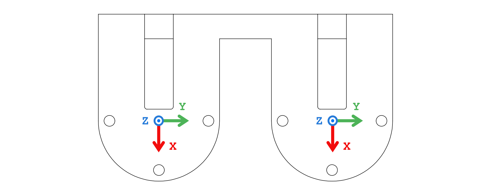
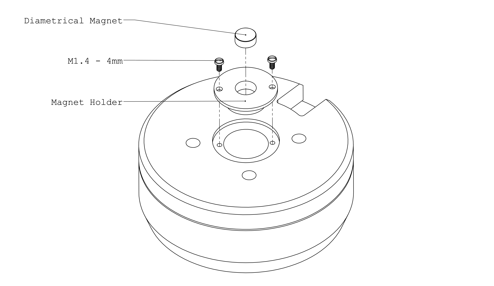
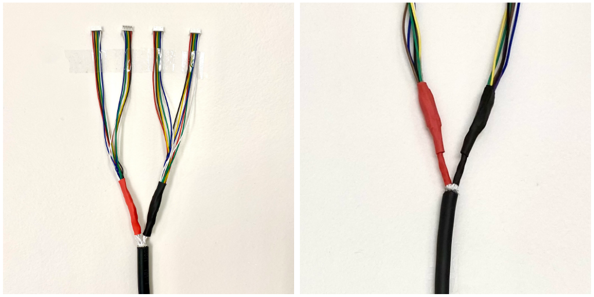
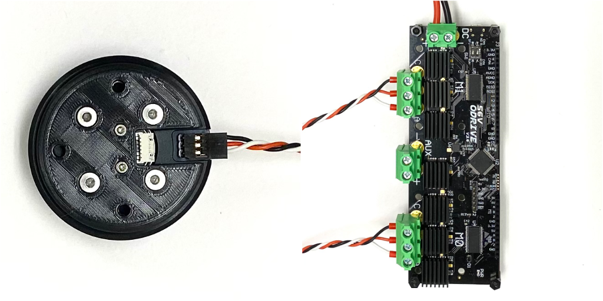
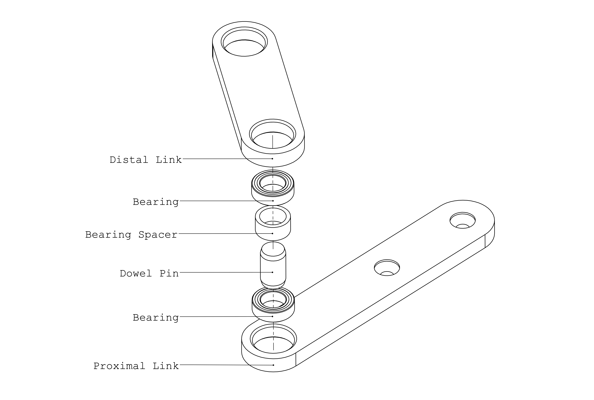
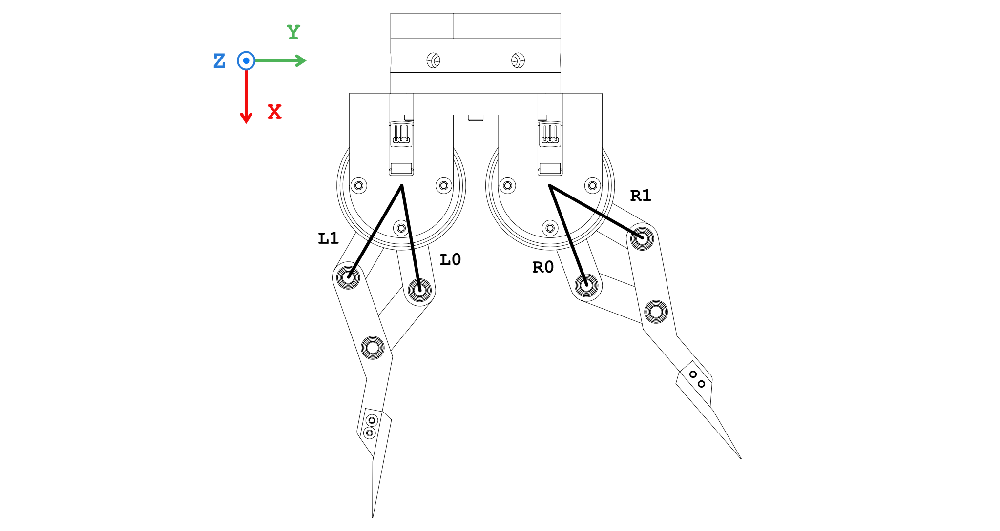
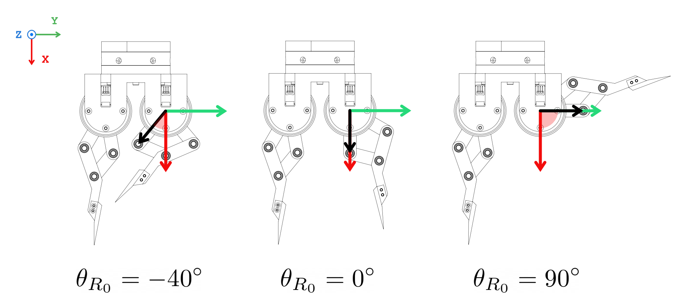
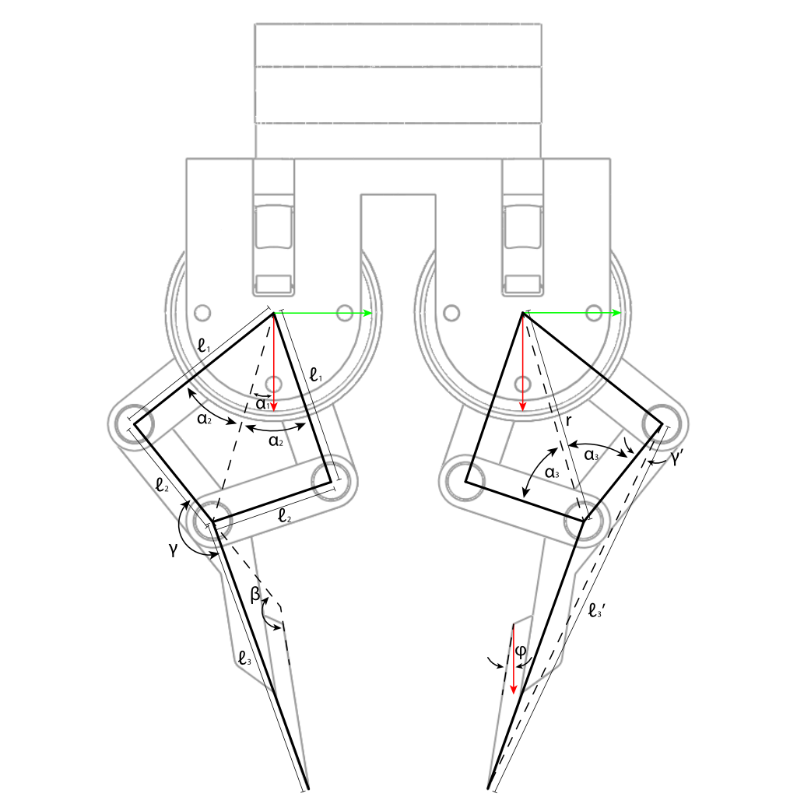

# Direct-Drive Hand

In this project, we have implemented a two-fingered 4-DoF direct-drive hand, inspired by the work ["Direct Drive Hands: Force-Motion Transparency in Gripper Design"](http://www.roboticsproceedings.org/rss15/p53.pdf). 


# Table of Contents

- [Preparation](#preparation)
  - [Bill of Materials (BOM)](#bom)
    - [Purchase](#purchase)
    - [3D Printing](#3d-printing)
  - [Install `ddh_software`](#install-pyddh)
  - [Label Components](#label-components)
- [Actuators](#actuators)
  - [Actuator Assembly ⨉4](#assemble-actuators)
  - [Wiring](#wiring)
    - [Encoder Connection](#encoder-connection)
    - [Power Connection](#power-connection)
  - [Actuator Calibration](#actuator-calibration)
    - [Calibrate ODrives](#calibrate-odrives)
    - [Calibrate Encoders](#calibrate-encoders)
- [Gripper](#Gripper)
  - [Finger Assembly ⨉2](#finger)
  - [Gripper Assembly](#gripper-assembly)
  - [Mounting](#mounting)
  - [Gripper Calibration](#gripper-calibration)
    - [Calibrate Motor Direction](#calibrate-motor-direction)
    - [Calibrate Linkages](#calibrate-linkages)
    - [Configure Gripper Geometry](#configure-gripper-geometry)
- [Customization](#customization)
  - [Mounting](#custom-mounting)
  - [Linkages](#linkages)
- [Getting Started](#getting-started)


# Preparation

<a name="bom"></a>

## Bill of Materials (BOM)


### Purchase

- [ODrive 3.6-56V](https://odriverobotics.com/shop/odrive-v36) ⨉2
- [T-Motor GB54-2](https://store.tmotor.com/goods.php?id=445) ⨉4
- [AS5048A Encoder + Diametrical Magenet](https://item.taobao.com/item.htm?id=619004953504) ⨉4
- [Bearing - outer-diameter = 10mm, inner-diameter = 6mm](https://item.taobao.com/item.htm?id=649671875461) ⨉12
- [Dowel Pin - diameter = 6mm, length = 10mm](https://detail.tmall.com/item.htm?id=522002486638) ⨉6
- [14-Core Shielded Cable TRVVSP4](https://detail.tmall.com/item.htm?id=649477061772) ⨉2 meters
- [MX1.25-6P 150mm Cable](https://item.taobao.com/item.htm?id=607231799768) ⨉4
- [AMASS Braided 3-Phase 90cm Cable](https://item.taobao.com/item.htm?id=520248392055) ⨉8
- Adapter Plate and Coupling: The gripper is primarily designed to be compatible with [Universal Robots UR10](https://www.universal-robots.com/products/ur10-robot/) (50mm PCD with 4 ⨉ M6, used with Robotiq's grippers). For other robot systems, see the section [Customization](#custom-mounting) for instructions.
- Various Fasteners from M2 to M4


### 3D Printing 

- [Magnet Holder](stl/magnet_holder.STL) ⨉4
- [Motor Plate](stl/motor_plate.STL) ⨉4
- [Proximal Link](stl/proximal_link.STL) ⨉4
- [Distal Link](stl/distal_link.STL) ⨉2
- [Distal Tip Link](stl/distal_tip_link.STL) ⨉2
- [Finger Tip](stl/finger_tip.STL) ⨉2
- [Actuator Mount](stl/actuator_mount.STL) ⨉1
- [Coupler](stl/coupler.STL) ⨉1
- [Calibration Stand](stl/calibration_stand.STL) ⨉4
- [Calibration Arm](stl/calibration_arm.STL) ⨉4

<a name="install-pyddh"></a>

## Install `ddh_software`

`ddh_software` is our driver software that provides a user interface to the gripper hardware. To install, visit [here](https://github.com/HKUST-RML/ddh_software).


## Part Labeling

To facilitate assembly, some parts need to be labeled as follows.

### Motors

Label the four motors with `R0`, `R1`, `L0`, `L1`, respectively. The motors will __not__ be interchangeable later.

### ODrive

Label the two ODrive boards with `ODrive_R` and `ODrive_L` respectively. Record their serial numbers in `ddh_software/config/ddh_default.yaml`. Execute command `odrivetools` in the terninal will display the serial number of the connected ODrive board.

```yaml
odrive_serial:
  R: 'Serial Number of ODrive_R'
  L: 'Serial Number of Odrive_L'
```

### Actuator Mount

On one side of the 3D-printed part `Actuator Mount` (to be used as the top side), mark reference frames as follows.




# Actuators


<a name="assemble-actuator"></a>
## Actuator Assembly ⨉ 4





## Wiring

We now make connections between the motors and the ODrive, both for the encoders and 3-phase power.


### Encoder Connection

For the encoder connection, we fabricate a cable assembly as shown below in the schematic. It is recommended to verify the connectivity and resistance of each connection to make sure the cables are soldered properly. We also recommend to label each connector like the schematic.




After successful fabrication, connect the motor encoders and the ODrives.

### Power Connection

For the power connection, the motors are matched with the ODrive axes as follows: 

| Actuator | ODrive | Axis |
|----|------|-----|
| R0 | ODrive_R | M0 |
| R1 | ODrive_R | M1 |
| L0 | ODrive_L | M0 |
| L1 | ODrive_L | M1 |

Keep the 3-phase connection consistent as shown below. *Also add a photograph of the cable assembly*




## Definitions

Here we provide definition of the direction of the rotor and zero position of the motor. 


### Direction of the Rotor
The direction the hexagonal logo on the rotor is pointing at will be referred to as the direction of the rotor. 


### Zero Position of the Motor
The motor is said to be in the zero position when the direction of the motor is pointing at the opposite direction of the power port on the stator. 


## Actuator Calibration

Each actuator module require calibration before use. This step __can not__ be done after the gripper is assembled, so do not postpone this step.

### Calibrate ODrives

Execute the following command and follow its instructions in the terminal.

```shell
python3 -m pyddh.calib_odrive
```

### Calibrate Zero Position

Here we calibrate the zero position of the motor. Mount the actuator on the calibration stand and install the calibration arm onto the actuator according to the diagram


Execute the following command to show real-time reading from the encoders.
```shell
python3 -m pyddh.check_encoder
```

Put the motor into zero position as show in the diagram below. Press down the calibration arm to make sure the stand and arm touch tightly. 


Record the encoder reading in configuration in `ddh_software/config/default.yaml`. Perform this calibration for each actuator and record it in their respective keys in the configuration file.
```yaml
motors:
  R0: # and R1, L0, L1:
    offset: the encoder reading at zero stop
```

After modifying the configuration file, execute the following command will show the real-time reading of the motor angular position in degrees.
```shell
python3 -m pyddh.check_motor_pos
```
It should be zero when motor is in [zero position](#zero-position-of-the-motor). Also try 90° and 180°. Don't mind the sign at this stage of assembly.


# Gripper

<a name="finger"></a>

## Finger Assembly ⨉ 2




## Gripper Assembly


## Docking on UR10 Arm


## Validation


First check are the linkages and actuators installed in their correct order. The association betwen proximal links and actuators should follow the diagram below __exactly__. If there is a mismatch, please go back to the assembly steps and correct the mistakes.






# Getting Started

You have completed the assembly and calibration of the direct-drive gripper. To learn about how to use the gripper, lease proceed to the [ddh_software](https://github.com/HKUST-RML/ddh_software) for tutorials and documation.


# Customization

<a name="custom-mounting"></a>

## Mounting


## Linkages



```yaml
geometry:
  l1: 50 # length of proximal links
  l2: 35 # length of distal links
  beta: 150 # angle from l2 to finger surface 
  l3: 80.04 # distance from distal joint to fingertip
  gamma: 160.66 # angle from l2 to fingertip
  # r: distance of distal joint to motor
  r_min_offset: 0 # r_min = sqrt(l1**2 - l2**2) + r_min_offset
  r_max_offset: 1 # r_max = l1 + l2 - r_max_offset
```


# Maintenance

For any technical issues, please contact Pu Xu ([pxuaf@connect.ust.hk](mailto:pxuaf@connect.ust.hk))
